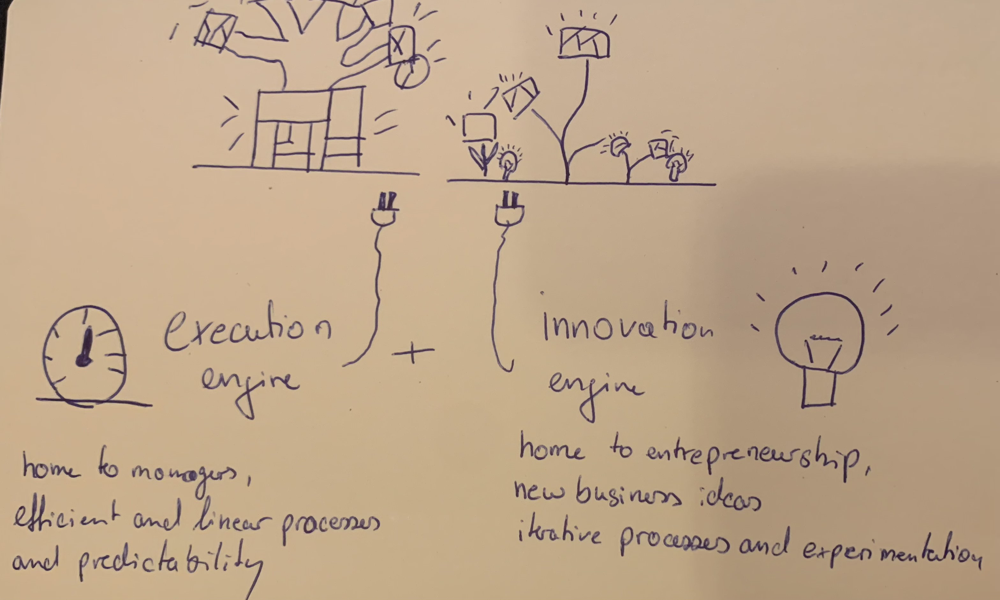

### Ambidextrous Organization
Xenia Oldenburger, Philipp Blum
---
### Table of Content
1. Meaning
1. Reason for Ambidexterity
1. Emergence of Ambidextrous organizations    
1. Exploitation and Exploration
1. Innovation
1. Ambidextrous organizations
1. Takeaways

---

### Background
* The Roman god Janus had two sets of eyes— one pair focusing on what lay behind, the other on what lay ahead. 

---
# Meaning
* &#34;***Ambidexterity***&#34; can be defined as a state of being equally adapted in the use of both the left and the right hand, and also in using them at the same time. 

---

### Reasons to transform 
* Communication problems
* Poor flexibility
* Long decision-making path
* Companies have a hard time innovating
* Ignoring change leads often to interruption

---
### Exploitation: 
It refers to constantly exploiting the available resources and ideas and making improvements wherever necessary. 
>> &rarr; Resources, process, units, structure, teams, etc.

---

### Exploration: 
Constantly innovating and exploring new ideas and opportunities. 
 >> &rarr; Innovations, optimization, improvements through change management 
 
---

### Why were Ambidextrous Organizations developed?

- ***Exploration*** and ***Exploitation*** were researched extensively and it was found out that these two ideas could not coexist in an organization
>> &rarr; Competition for resources
---

- Therefore multiple frameworks were build to make that possible.
>> &rarr; One of those frameworks is an "***Ambidextrous Organization***"

---

---

---

Exploitation | Exploration 
---| --- |
Investing in their core strengths | Discovering new resources |
Focusing on existing resources| Focusing on innovation |
***Results***: Reduction of change, avoidance of conflict | ***Results***: Embracing conflicts and using it positively, accepting and adapting to change, discovering new markets  | 

---

### Summary
To quickly sum up, what our research found out.
1. The essence of <html> <body> exploitation  </body> </html> is the <html> <body> refinement  </body> </html> and extension of <html> <body> existing competencies, technologies, and paradigms.  </body> </html>
2. Exploration tries to  shift to a new technology which means finding a new trajectory. It's done by planned experimentation and play.
3. The essence of <html> <body> exploration  </body> </html>is <html> <body> explerimentation  </body> </html> with new alternatives to come up with new ideas.

---
### Ambidextrous Organization

- Exploration and Exploitation 
- Innovation
- Success

---

### Ambidextrous Organizations

[Be efficient in todays management and also be able to adapt tomorrows changes.](https://app.animaker.com/previewslides/WHFtBJYZHFcUj3qD)

1. centralized vs decentralized
2. tight, strict culture vs loose culture
3. Maximize efficiency vs frequent experiments

<html> <body>  </body> </html>

---

### Upsides
<html> <body>  </body> </html>

On this picture you can see the upsides of both exploration and exploitation approaches.

---

### Example

Johnson & Johnson, Hewlett Packard

<html> <body>  </body> </html>

----
### Main takeaways

1. To stay relevant you have to constantly innovate. 
2. Approaches to that are exploration and exploitation. 
3. The framework that makes both of those concepts possible is ambidextrous organization.
4. Ambidextrous organization is a way to capture the challenge in businesses being able to make steady improvements to existing models whilst still developing breakthrough innovations.

---

# Thank you for your attention!

---
### Sources

https://en.wikipedia.org/wiki/Ambidextrous_organization

https://en.wikipedia.org/wiki/Ambidexterity

https://hbr.org/2004/04/the-ambidextrous-organization

https://news.stanford.edu/pr/97/970626oreilly.html

https://www.hbs.edu/ris/Publication%20Files/O'Reilly%20and%20Tushman%20AMP%20Ms%20051413_c66b0c53-5fcd-46d5-aa16-943eab6aa4a1.pdf

https://www.researchgate.net/publication/255644722_The_Interplay_Between_Exploration_and_Exploitation

---

https://jbepnet.com/journals/Vol_2_No_4_December_2015/4.pdf

THE CONCEPT OF THE AMBIDEXTROUS ORGANIZATION: SYSTEMATIC LITERATURE REVIEW